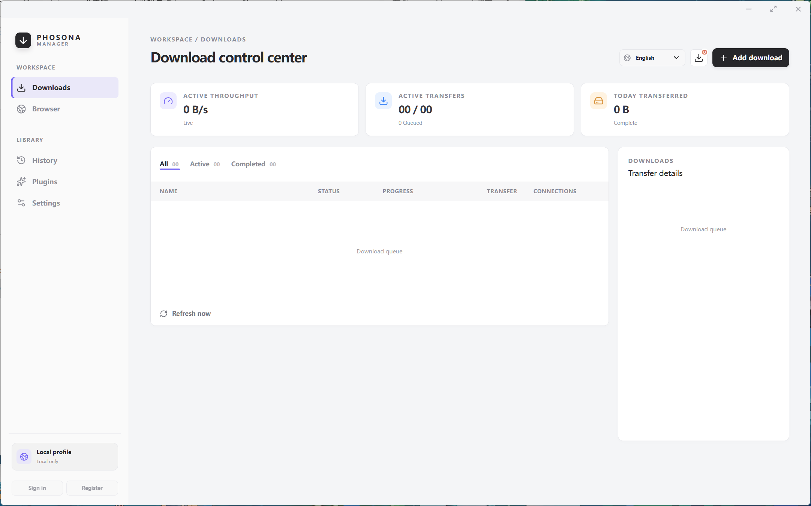
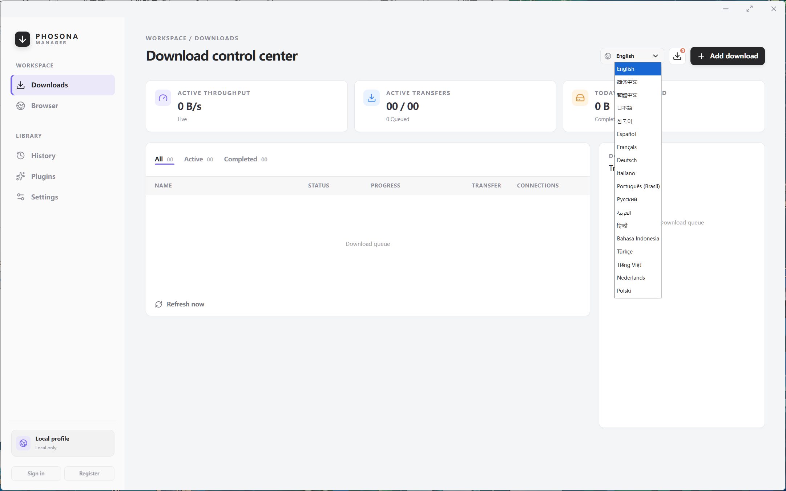

# Phosona Manager

Phosona Manager is a cross-platform desktop download manager. It uses Electron for the desktop window and browser workspace, Preact for the user interface, and a bundled Rust download engine for transfers.

This repository is used only to publish Phosona Manager binary installers. Download installers and update metadata from [GitHub Releases](https://github.com/balovess/Phosona_Manager/releases).

[中文说明](README_CN.md)

[Privacy Policy](PRIVACY.md)

[Plugin documentation](plugins/README.md)

## Screenshots

> The screenshots below are for reference only and do not represent the final release UI. The interface may differ substantially in the official version.

### Download control center

### Language selection

## Features

- HTTP, HTTPS, and BitTorrent downloads
- Adding URLs, magnet links, and `.torrent` files
- Pause, resume, remove, queue management, and download-directory configuration
- Concurrency, connection, speed-limit, proxy, and other aria2 transfer options
- Built-in browser workspace with multiple tabs, history, and bookmarks
- Browser resource observer for discovering media, files, and streaming resources
- Centralized browser downloads with optional forwarding of required headers and cookies
- Download floating window, system tray, launch-at-login, and always-on-top support
- BitTorrent peer, tracker, DHT, and seeding status
- Privacy mode, deny-by-default permissions, and browsing-data cleanup
- Permission-constrained declarative plugin system
- Multilingual interface with Arabic RTL layout support

## Download and installation

Download the installer matching your operating system and CPU architecture from [Releases](https://github.com/balovess/Phosona_Manager/releases):

| Platform | Installer |
| --- | --- |
| Windows | `Phosona-Manager-<version>-win-<arch>.exe` |
| macOS | `Phosona-Manager-<version>-mac-<arch>.dmg` |
| Linux | `Phosona-Manager-<version>-linux-<arch>.AppImage` |

After the first launch, choose the download directory, concurrency, proxy, BitTorrent, and privacy options in Settings. The application starts its local download engine automatically. RPC listens only on the local loopback address and is not exposed to the LAN.

## Privacy and security boundaries

- The application manages the download engine; its RPC port and random secret are not exposed in the UI or logs.
- Browser pages run in a restricted Electron session without Node.js or Electron main-process access.
- Browser permissions are denied by default. Cookie forwarding, resource observation, and plugin permissions require explicit user opt-in.
- Plugins currently support declarative network rules only. They cannot execute plugin JavaScript or access Node.js, Electron, the shell, or arbitrary file paths.
- Strict privacy mode blocks known tracking and fingerprinting requests. It is not anonymous networking or a VPN.

## Current version

The current version is `0.1.0 Preview`. Some capabilities are still being validated. Before a formal release, test installation, download recovery, BitTorrent, browser resource capture, and uninstallation in a clean environment.

In-app updates require an HTTPS update source to be configured by the release environment. If the application displays “Update source is not configured”, install the newer version manually from Releases.

## Project relationship

Phosona Manager delegates download tasks to a Rust download engine, while Electron handles desktop windows, browser sessions, and system integration, and the frontend provides the user interface. Binary distribution does not include or replace all upstream licenses and copyright notices. Read the notes in the relevant Release and the license files shipped with the installer before use.
